# Team Development Plan

## Overview

Two parallel workstreams. Frontend builds with **hardcoded mock data** behind a service abstraction layer — when Backend APIs are ready, swap one import and it's live. No blocking dependencies.

---

## 🔙 Backend Team Plan

### Priority Order & Deliverables

Each module already has `controller → service → router → validator` scaffolded. The work is **implementing the service logic** and testing endpoints.

---

#### Sprint 1 — Core Pipeline (Day 1–2)

| # | Module | Task | Deliverable |
|---|--------|------|-------------|
| 1 | **OCR** | Implement Gemini 3 Flash + GPT-4o Vision dual-provider | `POST /api/ocr` returns structured Markdown with LaTeX |
| 2 | **Summarizer** | Implement GPT-4o TL;DR with ≤3 plain-English takeaways | `POST /api/summarize` returns `{ takeaways: string[] }` |
| 3 | **Capture** | Implement PDF parsing (`pdf-parse`) + base64 image ingestion | `POST /api/capture/upload` and `/screen` |

#### Sprint 2 — Audio Pipeline (Day 2–3)

| # | Module | Task | Deliverable |
|---|--------|------|-------------|
| 4 | **TTS** | Implement OpenAI TTS + GPT-powered semantic chunking (LaTeX → speech) | `POST /api/tts/synthesize` (returns mp3), `/chunk` (returns chunks[]) |
| 5 | **Tutor** | Implement Whisper STT transcription + contextual GPT Q&A | `POST /api/tutor/transcribe` + `/ask` |

#### Sprint 3 — Polish (Day 3–4)

| Task | Details |
|------|---------|
| Error handling | Ensure all modules return consistent `{ success, error, message }` |
| Rate limiting | Add `express-rate-limit` to protect API keys |
| Streaming | Add SSE/streaming for TTS chunks (real-time playback) |
| `.env` validation | Fail fast on startup if API keys are missing |

### API Contract (for Frontend to mock against)

```
POST /api/ocr
  Body: { imageBase64: string, provider?: "gemini" | "openai" }
  Response: { success: true, data: { markdown: string, provider: string } }

POST /api/summarize
  Body: { text: string, maxTakeaways?: number }
  Response: { success: true, data: { takeaways: string[], tokensUsed: number } }

POST /api/capture/upload
  Body: FormData with file
  Response: { success: true, data: { filename, mimetype, size, text } }

POST /api/capture/screen
  Body: { imageBase64: string }
  Response: { success: true, data: { capturedAt, imageSize } }

POST /api/tts/synthesize
  Body: { text: string, voice?: "nova" | "alloy" | ... }
  Response: audio/mpeg binary

POST /api/tts/chunk
  Body: { markdown: string }
  Response: { success: true, data: { chunks: string[] } }

POST /api/tutor/ask
  Body: { question: string, context?: string }
  Response: { success: true, data: { question, answer, tokensUsed } }

POST /api/tutor/transcribe
  Body: FormData with audio
  Response: { success: true, data: { text: string } }
```

---

## 🎨 Frontend Team Plan

### Design Philosophy
> **"Every screen should feel like a polished product, not a hackathon demo."**

Key principles:
- **Dark mode first** with high-contrast accessible colors
- **Glassmorphism** cards with `backdrop-filter: blur`
- **Micro-animations** on every interaction (hover, click, transitions)
- **OpenDyslexic** font toggle always accessible
- Smooth **page transitions** with Framer Motion

### Mock Data Strategy

Create a service abstraction layer so data sources are swappable in one line:

```
frontend/src/
├── services/
│   ├── api.js              ← real API calls (axios/fetch to backend)
│   ├── mock.js             ← hardcoded mock data (used first)
│   └── index.js            ← export: toggles between mock & real
```

```js
// services/index.js
const USE_MOCK = true; // ← flip to false when backend is ready

export const ocrService    = USE_MOCK ? require('./mock').ocr    : require('./api').ocr;
export const ttsService    = USE_MOCK ? require('./mock').tts    : require('./api').tts;
export const summarizer    = USE_MOCK ? require('./mock').summarizer : require('./api').summarizer;
export const tutorService  = USE_MOCK ? require('./mock').tutor  : require('./api').tutor;
export const captureService= USE_MOCK ? require('./mock').capture: require('./api').capture;
```

### Page-by-Page UI Spec

---

#### Page 1: 🏠 Landing / Home

**Layout:** Full-screen hero with animated gradient background

| Element | Animation | Detail |
|---------|-----------|--------|
| App title + tagline | Fade-in + slide-up on load | "Your AI Learning Companion" |
| Drag & Drop zone | Pulse border glow on hover | Accept PDF/images, dashed border |
| "Capture Screen" button | Scale-up + ripple on click | Triggers `Cmd+Shift+A` or file picker (web fallback) |
| Recent captures card list | Staggered slide-in from bottom | Glassmorphism cards with thumbnails |

**Mock data:** 3 sample capture cards with sample thumbnails, titles, timestamps

---

#### Page 2: 📄 Reader / Bionic Teleprompter

**Layout:** Split-screen — content left, controls right

| Element | Animation | Detail |
|---------|-----------|--------|
| Rendered Markdown content | Typewriter fade-in per paragraph | High-contrast, large text |
| **Dynamic highlight bar** | Smooth translateY following TTS position | Yellow highlight on current sentence, dim others |
| Font toggle (OpenDyslexic) | Morph animation between fonts | Floating pill button, top-right |
| Play / Pause / Speed controls | Scale micro-bounce on click | Circular buttons with progress ring |
| Voice interrupt button (🎤) | Breathing pulse animation when active | Large, centered at bottom |

**Mock data:** 2-3 paragraphs of sample academic text with LaTeX formulas rendered via KaTeX

---

#### Page 3: 🧠 Summary Panel (Overlay)

**Layout:** Slide-in panel from right (or bottom on mobile)

| Element | Animation | Detail |
|---------|-----------|--------|
| Panel container | Slide-in + backdrop blur | 400px wide, glassmorphism |
| Takeaway cards (1–3) | Staggered pop-in, numbered | Colored left border per card |
| "Read Full" / "Dismiss" buttons | Hover scale + glow | Bottom of panel |
| Token usage badge | Count-up number animation | Small, muted, bottom-right |

**Mock data:** 3 hardcoded takeaway strings

---

#### Page 4: 🎙️ Tutor Chat

**Layout:** Chat-style interface, bottom input

| Element | Animation | Detail |
|---------|-----------|--------|
| Chat bubbles | Slide-in from left (AI) / right (user) | Rounded, with avatar icons |
| Voice recording indicator | Pulsing red dot + waveform | Shows during mic recording |
| "Thinking..." loader | 3-dot bounce animation | While waiting for AI response |
| Context snippet | Collapsed accordion, expandable | Shows what text is being discussed |

**Mock data:** 3 pre-scripted Q&A exchanges

---

### Component Hierarchy

```
src/
├── components/
│   ├── layout/
│   │   ├── Navbar.jsx             ← top nav with logo + font toggle
│   │   ├── Sidebar.jsx            ← optional navigation
│   │   └── PageTransition.jsx     ← Framer Motion wrapper
│   ├── capture/
│   │   ├── DragDropZone.jsx       ← file drop area with animation
│   │   ├── CaptureCard.jsx        ← thumbnail card for past captures
│   │   └── ScreenCaptureBtn.jsx   ← global capture trigger
│   ├── reader/
│   │   ├── BionicReader.jsx       ← main teleprompter with highlight
│   │   ├── AudioControls.jsx      ← play/pause/speed
│   │   ├── FontToggle.jsx         ← OpenDyslexic switch
│   │   └── HighlightSentence.jsx  ← individual highlighted sentence
│   ├── summarizer/
│   │   ├── SummaryPanel.jsx       ← slide-in overlay
│   │   └── TakeawayCard.jsx       ← single takeaway item
│   ├── tutor/
│   │   ├── TutorChat.jsx          ← chat interface
│   │   ├── ChatBubble.jsx         ← single message bubble
│   │   ├── VoiceRecorder.jsx      ← mic recording + waveform
│   │   └── ThinkingIndicator.jsx  ← bounce dots loader
│   └── ui/
│       ├── GlassCard.jsx          ← reusable glassmorphism card
│       ├── AnimatedButton.jsx     ← button with hover/click effects
│       ├── ProgressRing.jsx       ← circular progress indicator
│       └── WaveformVisualizer.jsx ← audio waveform display
├── pages/
│   ├── HomePage.jsx
│   ├── ReaderPage.jsx
│   ├── TutorPage.jsx
│   └── SettingsPage.jsx
├── services/
│   ├── index.js
│   ├── mock.js
│   └── api.js
├── hooks/
│   ├── useAudioPlayer.js         ← TTS playback + position tracking
│   ├── useVoiceRecorder.js       ← mic recording hook
│   └── useElectronIPC.js         ← Electron bridge (no-op in browser)
└── styles/
    └── fonts/                     ← OpenDyslexic font files
```

### Frontend Sprint Plan

#### Sprint 1 — Design System + Home (Day 1–2)

| Task | Owner | Detail |
|------|-------|--------|
| Design tokens in Tailwind config | FE Lead | Colors, fonts, shadows, blur values |
| `GlassCard`, `AnimatedButton`, `ProgressRing` | FE 1 | Reusable UI primitives |
| `Navbar` + page routing (React Router) | FE 1 | With `PageTransition` wrapper |
| `DragDropZone` + `CaptureCard` | FE 2 | With pulse/glow animations |
| `HomePage` assembly | FE 2 | Hero + drag zone + recent captures |
| Mock service layer (`mock.js`) | FE Lead | All 5 modules with realistic sample data |

#### Sprint 2 — Reader + Summary (Day 2–3)

| Task | Owner | Detail |
|------|-------|--------|
| `BionicReader` + `HighlightSentence` | FE 1 | Core teleprompter with dynamic highlight |
| `AudioControls` + `useAudioPlayer` hook | FE 2 | Play/pause/speed with progress ring |
| `FontToggle` (OpenDyslexic) | FE 1 | Morph animation between fonts |
| `SummaryPanel` + `TakeawayCard` | FE 2 | Slide-in overlay with staggered pop-in |
| `ReaderPage` assembly | FE Lead | Wire everything with mock data |

#### Sprint 3 — Tutor + Polish (Day 3–4)

| Task | Owner | Detail |
|------|-------|--------|
| `TutorChat` + `ChatBubble` | FE 1 | Chat interface with slide-in bubbles |
| `VoiceRecorder` + `WaveformVisualizer` | FE 2 | Mic recording with visual feedback |
| `ThinkingIndicator` | FE 1 | 3-dot bounce loader |
| `TutorPage` assembly | FE Lead | Full chat flow with mock Q&A data |
| **Swap mock → real API** | FE Lead | Flip `USE_MOCK = false` in `services/index.js` |

---

## 📅 Shared Timeline

```mermaid
gantt
    title Development Timeline
    dateFormat  YYYY-MM-DD
    axisFormat  %b %d

    section Backend
    OCR + Summarizer + Capture     :b1, 2026-02-21, 2d
    TTS + Tutor                    :b2, after b1, 1d
    Polish + Streaming             :b3, after b2, 1d

    section Frontend
    Design System + Home Page      :f1, 2026-02-21, 2d
    Reader + Summary Panel         :f2, after f1, 1d
    Tutor Chat + Polish            :f3, after f2, 1d

    section Integration
    Mock → Real API Swap           :crit, i1, after b2, 1d
    End-to-End Testing             :crit, i2, after i1, 1d
```



## 🔗 Integration Protocol

1. **Frontend never waits for backend** — build with `mock.js` first
2. When a backend endpoint is ready, **backend dev pings frontend dev** with a sample `curl` command
3. Frontend dev adds the real call in `api.js` and tests
4. When all endpoints pass, flip `USE_MOCK = false`
5. Final end-to-end walkthrough with real API keys
